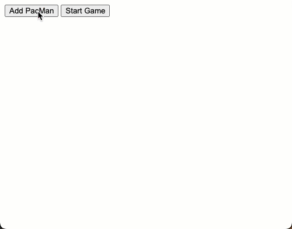

# PacMen

## Descripción

En este proyecto se tiene la posibilidad de agregar varios pacman que se iran desplazando por la ventana del navegador pero sin superar sus límites.

## Ejecución

<ol>
<li>Descargar los archivos:
    <ol>
    <li>Entrar a la pestaña Code</li>
    <li>Dar clic en el botón <>Code</li>
    <li>Esto abrirá una pequeña ventana donde se debe seleccionar la opción Download ZIP</li>
    </ol>
</li>
<li>Descomprimir el directorio descargado</li>
<li>ingresar a la carepta principal</li>
<li>Abrir el archivo index.html en el navegador web de su preferencia</li>
<li>Dar clic en el botón [Add Pacman], esto agregará un pacman a la pantalla por cada clic que se dé</li>
<li>Dar clic en el botón [Start Game], esto dará animación a los pacmans agregados</li>
<li>Si lo desea puede dar clic nuevamente al botón [Add Pacman] para agregar mas pacman a la pantalla</li>
</ol>

## Roadmap

<ol>
<li>Agregar controles para aumentar o disminuir la velocidad de cada pacman</li>
<li>Detectar Colisiones entre pacman para que haya un efecto en la dirección</li>
</ol>

## Licencia

MIT Licence